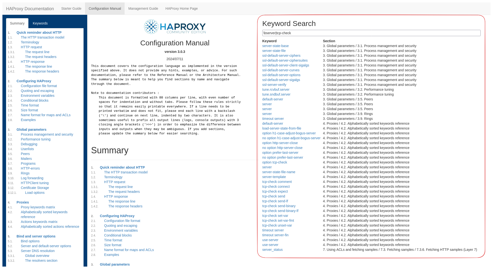

# HAProxy Documentation Keyword Search

This repository contains a small Tampermonkey script that adds a keyword search to the HAProxy Configuration Manual website.

It adds a third column titled "Keyword Search" to the site (as pictured below) that contains an input field where you can enter a regular expression to filter the keywords displayed in the table. Filtering only happens on the "Keyword" column, the "Section" column is only there to give you more context because the same keyword (for example `server`) exists multiple times.

Each keyword when clicked takes you to the related documentation.

## Modified Website

The following image shows the modified website. The elements outlined in red are added by the script.

## License

The code in this repository is licensed under the MIT license.
